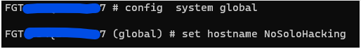
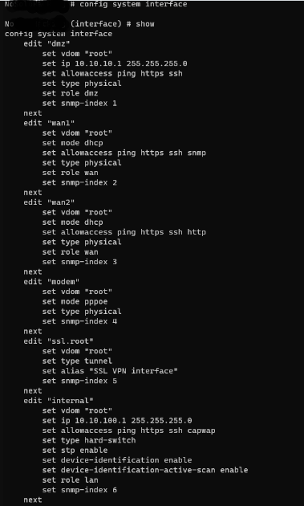
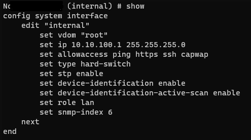
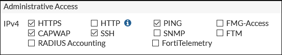

# **Comandos para un Firewall Fortinet**

<div align="center">

|# ID | Tópicos                                                   |
|------|:---------------------------------------------------------:|
| 01  |  [Configurar Hostname](#configurar-hostname)|
| 02  |  [Listar Configuración de Interfaces](#listar-configuración-de-interfaces)|
| 03  |  [Listar Configuración de una Interface](#listar-configuración-de-una-interface)|
| 04  |  [Configurar una IP interna de Gestión](#configurar-una-ip-interna-de-gestión)|
| 05  |  [Configuración de Protocolos](#configurar-uno-o-más-protocolos-de-acceso-de-gestión)|

</div>
<hr>
<div align ="center">
    <h3> 😊 Thanks for your visit! 😊</h3>
    <p>
    This repository has been created with a lot of ❤️ </br>
    ¡Come back soon!
    </p>
    <small>Apoyame para seguir compartiendo material educacional</small> <br /> 
    <a href="https://www.paypal.com/donate/?hosted_button_id=FXLEYP4FXC5B2" target="_blank">
    
    </a>
</div>

<hr>

## Configurar Hostname

```bash
FGT # config system global
FGT (global) # set hostname [nombre]
```



## Listar Configuración de interfaces 

```bash
FGT # config system interface
FGT (interface) # show
```


## Listar Configuración de una interface

```bash
FGT # config system interface
FGT (interface) # edit [nombre interfaz]
FGT (interface) # show
```
Ejemplo : *FGT (interface) # edit internal*



## Configurar una IP interna de gestión

- En primer lugar, entramos en la configuración de las interfaces con el comando:  

    ```bash
    FGT # config system interface
    ``` 

- Para editar la interfaz, ejecutamos:

    ```bash
    FGT (interface) # edit [nombre interfaz]
    ```
    - Ejemplo: 
    
        ```bash
        FGT (interface) # edit internal
        ```

- Configurar una IP

    ```bash
    FGT (internal) set ip [IP] [MSK Red]
    ```
    - Ejemplo: 
        
        ```bash
        FGT (internal) set ip 10.10.10.1 255.255.255.0
        ```

> Para que los cambios se realizen ejecutar ` FGT (internal) # end`


## Configurar uno o más protocolos de acceso de gestión

Si queremos gestionar nuestro **FW**, podemos habilitar el protocolo que queremos de los siguientes que tenemos disponibles: 



Si queremos habilitar uno o varios ejecutamos: 

```bash
FGT (internal) # set allowaccess [protocolo]
```

Ejemplo:

```bash
FGT (internal) # set allowaccess https ssh ping
```


> Para que los cambios se realizen ejecutar ` FGT (internal) # end`

